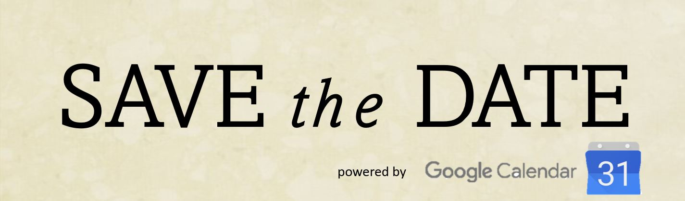

## Sie Wurden Eingeladen !

Am 19. April vollendet der junge Herr K sein 25. Lebensjahr.
Sein Eventmanagement-Team möchte Sie, in seinem Namen, hiermit herzlichst einladen mit ihm zu feiern.
Die Feierlichkeiten beginnen am 23. April gegen 19 Uhr und Enden nicht vor dem Morgengrauen.
Wir möchten Sie bitten **sich im Varaus über <a href="https://doodle.com/meeting/participate/id/1aMOO2Pd">unsere Doodle-Umfrage</a> anzumelden**.

## Location

Als Location wurde Herrn K's Sommerresidenz am Westerberg ausgewählt. Mit einem wunderbaren Blick über die Ländereien der Stadt Osnabrück und einer prunkvollen Gartenanlage.
An der Zufahrtsstraße zum Anwesen finden Sie zahlreiche Parkmöglichkeiten, falls sie mit dem Wagen anreisen. Leider ist der Park-Service momentan nicht verfügbar. Sollten Sie etwas umweltfreundlicher mit den öffentlichen Verkehrsmittlen anreisen, so dürfen Sie sich über eine exklusive Haltestelle ,direkt vor dem Anwesen, freuen. 
Da sich der Nordflügel mit den Gästezimmern aktuell im Umbau befindet, können den Gästen leider keine Zimmer im Haus angeboten werden.
Sie dürfen allerdings gerne stehend oder sitzend im Atrium der verweilen, bis sie Ihre Heimreise wieder selbstständig antreten können.
Alternativ kontaktieren wir gerne für Sie ihre/n Chauffeur/in.
In den ersten Morgenstunden, nach 5 Uhr, laden auch Busse und Bahnen wieder zur Heimreise ein.
<iframe src="https://www.google.com/maps/embed?pb=!1m18!1m12!1m3!1d2440.870240627841!2d8.008230315798585!3d52.28205767976979!2m3!1f0!2f0!3f0!3m2!1i1024!2i768!4f13.1!3m3!1m2!1s0x47b9e675366faa3f%3A0xd67ddf10fe82254a!2zSMOkbmRlbHN0cmHDn2UgMTAsIDQ5MDc2IE9zbmFicsO8Y2s!5e0!3m2!1sde!2sde!4v1649174619758!5m2!1sde!2sde" width="600" height="300" style="border:0;" allowfullscreen="" loading="lazy" referrerpolicy="no-referrer-when-downgrade"></iframe>

## Catering

Die Hausbar bieter am Abend rustikale Drinks. Darunter frisch geöffnetes Flaschenbier, leicht entflammbare Kleinstgefäßgetränke, sowie verschiedenste Mischvariationen.
Weiterhin verwöhnt Sie unser Catering-Team mit kleinen Snacks für zwischendurch. 
Sollte uns das Wetter an diesem Tag wohlgesonnen sein, wird das Küchenpersonal außerdem die weitläufige Open-Air-Küche nutzen, um fleischhaltige Speisen zu zaubern. Selbstverständlich werden auch fleischlose Gerichte angeboten.
Alternativ wird Verpflegung italienischer Herkunft von der nahegelegenen Gastronomie serviert. 
